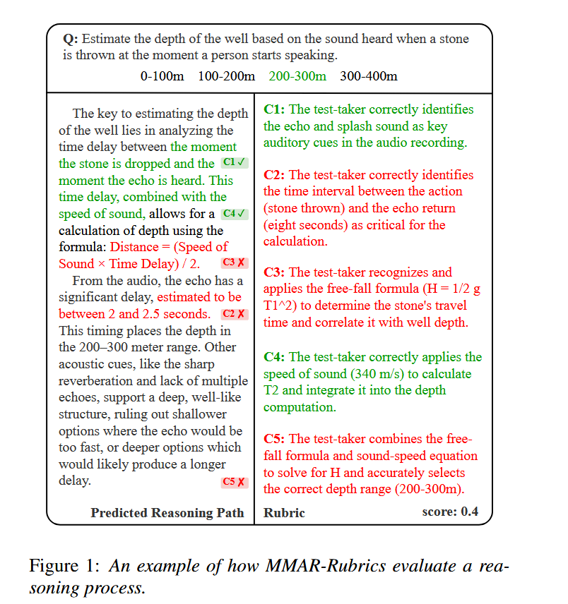
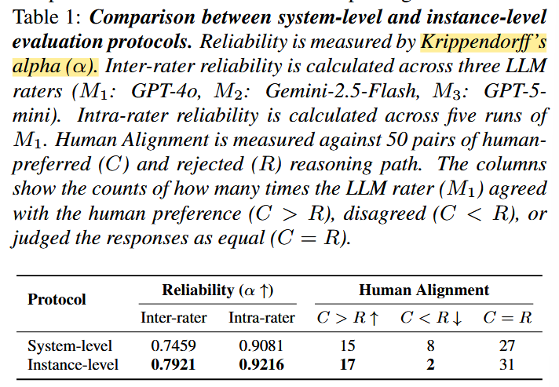
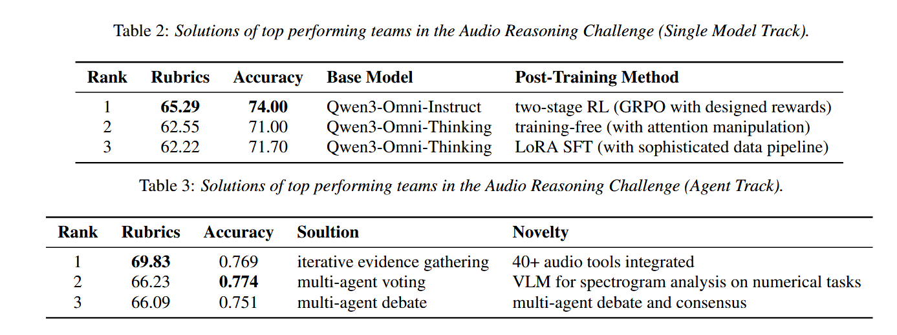
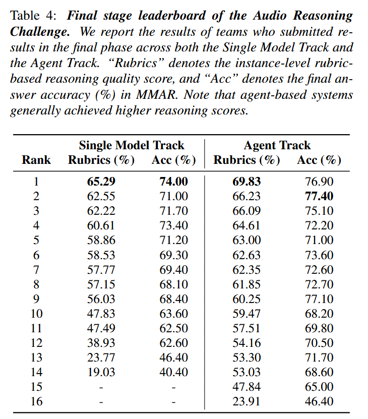

[TOC]

为了防止MMAR只基于结果的二值评分（0 or 1）现象的出现，MMAR-Rubris给每个MMAR的task都加上了结合具体题目场景的对cot进行打分的rubrics。每题的rubrics是由Gemini-2.5-Pro生成的。

## 一、MMAR-Rubrics的评测方式

设置明确的rubrics来帮助llm客观的评分：

具体评分规则：

有输入audio A,query Q：

$$
(\hat{Y_{cot}} , \hat{Y_{answer}})= F(A,Q)
$$

得分规则为：

$$
S = \begin{cases}
\mathcal{E}(\hat{Y}_{\text{CoT}}) & \text{if } \hat{Y}_{\text{Answer}} = Y_{\text{Answer}} \\
0 & \text{if } \hat{Y}_{\text{Answer}} \neq Y_{\text{Answer}}
\end{cases}
$$

一个task有k个criteria，则：

$$
\mathcal{E} (\hat{Y_{cot}}) = \frac{1}{k}\sum_{i=1}^{k}{\text{I(criterion}_i \text{ is satisfied)}}
$$

评测支持两个track,一个single-model track,一个agent track。

## 二、实验设计和结果

### 2.1 证明MMAR-Rubrics的instance-level比general-system-level的评测基线优秀

#### 2.1.1 实验结果

#### 2.1.2 Inter-rater 和 Intra-rater
**Inter-rater**（组间一致性）：

测试方式：找 3 个完全不同的 AI 裁判（GPT-4o、Gemini-2.5-Flash、GPT-5-mini）给相同的 664 条推理路径打分。

目的：看不同模型之间的标准合不合，避免某种特定模型产生偏见。

**Intra-rater**（评分者内一致性 / 自身稳定性）：

测试方式：让同一个 AI 裁判（GPT-4o，在温度设为 Temperature = 1.0 的随机状态下）连续跑 5 次。

目的：看模型自己打分稳不稳定。

#### 2.1.3 Human Alognment

研究者抽取了 50 对回答（每对包含人类认可的回答 $C$ 和人类拒绝的坏回答 $R$）：

$C > R \uparrow$（看对）：AI 打分也认为好回答 $C$ 高于坏回答 $R$（越高越好）。

$C < R \downarrow$（偏好倒置 / 判反了）：AI 竟然觉得坏回答 $R$ 比好回答 $C$ 还好，属于致命的判定错误（越低越好）。

$C = R$：AI 觉得两者差不多（打平）。

#### 2.1.4 结论

作者提出的 Instance-level (MMAR-Rubrics) 相比于旧的 System-level baseline 实现全方位碾压：

- **跨模型打分更统一**：不同模型间的一致性 $\alpha$ 从 $0.7459$ 飙升到 $0.7921$（逼近 $0.8$ 的黄金线）。

- **自身重测极度稳定**：同一个模型的自身重复测试一致性高达 $0.9216$。

- **严重低级错误骤降**：把人类喜欢的判成坏的（$C < R$ 的偏好颠倒）从原来的 8 次直接砍到了 2 次。

#### 2.1.5 数学知识补贴：Krippendorff's Alpha

##### 2.1.5.1 数学定义

**这是一个用来测量“多个裁判（评分者）意见到底有多一致”的统计学指标。**

直观公式：

$$\alpha = 1 - \frac{D_o}{D_e}$$

$D_o$（Observed Disagreement）：裁判们打分时实际产生的分歧。

$D_e$（Expected Disagreement）：假设裁判们完全闭着眼睛瞎猜时，理论上会产生的随机分歧。

数值含义：

$\alpha = 1$：所有人意见 $100\%$ 完全一致。

$\alpha = 0$：大家的打分完全等同于抛硬币瞎猜。

黄金标准：通常 $\alpha \ge 0.8$ 被认为是极度可靠；$\alpha \ge 0.7$ 属于非常优秀的社会学/评估一致性。

##### 2.1.5.2 例子1

假设我们有 **2 个样本**，请了 **3 位裁判** 打分（只能打 **1 分** 表示通过，**0 分** 表示不通过）：

* **样本 A**：裁判 1 打 `1`，裁判 2 打 `1`，裁判 3 打 `0`
* **样本 B**：裁判 1 打 `0`，裁判 2 打 `0`，裁判 3 打 `0`

---

样本A：我们可以把 3 个裁判两两组合，形成 3 个配对：

* 裁判 1 (打1) 和 裁判 2 (打1) $\rightarrow$ 打分一样（分歧 = 0）
* 裁判 1 (打1) 和 裁判 3 (打0) $\rightarrow$ 打分不一样（分歧 = 1）
* 裁判 2 (打1) 和 裁判 3 (打0) $\rightarrow$ 打分不一样（分歧 = 1）

一共 3 个配对，有 2 个配对产生分歧。

样本B同样两两组合，形成 3 个配对：

* 裁判 1 (打0) 和 裁判 2 (打0) $\rightarrow$ 打分一样（分歧 = 0）
* 裁判 1 (打0) 和 裁判 3 (打0) $\rightarrow$ 打分一样（分歧 = 0）
* 裁判 2 (打0) 和 裁判 3 (打0) $\rightarrow$ 打分一样（分歧 = 0）

一共 3 个配对，有 0 个配对产生分歧。则全部配对总数 = 样本 A 的 3 对 + 样本 B 的 3 对 = 6 对，发生分歧的配对总数 = 2 + 0 = 2 对

$$D_o = \frac{\text{发生分歧的配对数}}{\text{总配对数}} = \frac{2}{6} = \frac{1}{3} \approx 0.333$$

从上面的样本 A 和 B 里，裁判一共打了 6 个分数：

* 样本 A 出了：`[1, 1, 0]`
* 样本 B 出了：`[0, 0, 0]`
* 帽子里的 6 个球：`1, 1, 0, 0, 0, 0` （也就是 2 个“1” 和 4 个“0”）。

从 6 个球里任意抽取 2 个球，总共有15种抽法。

要抽到一个 `1` 和一个 `0`：

* 从 2 个 `1` 里抽 1 个，有 2 种可能；
* 从 4 个 `0` 里抽 1 个，有 4 种可能；

$$\text{产生分歧的抽法数} = 2 \times 4 = 8 \text{ 种}$$

则：

$$D_e = \frac{\text{随机抽能产生分歧的种数}}{\text{随机抽的总种数}} = \frac{8}{15} \approx 0.533$$

现在我们有了：

* 实际分歧 $D_o = 0.333$
* 瞎猜分歧 $D_e = 0.533$

直接带入公式：

$$\alpha = 1 - \frac{D_o}{D_e} = 1 - \frac{0.333}{0.533} = 1 - 0.625 = 0.375$$
实际分歧比乱猜分歧要小，说明裁判们还是有一定默契的，但 $\alpha = 0.375$ 距离理想值（$\ge 0.8$）还差得很远。

##### 2.1.5.4 例子2

在 MMAR-Rubrics 场景中，虽然底层细则是 0/1 勾选，但汇总给整条推理路径打出来的是 **0.0 ~ 1.0 的连续得分**（如 $2/5 = 0.4$ 分）。此时差异用“数值差的平方” $\delta^2(k, l) = (k - l)^2$ 来度量。

假设让 GPT-4o（裁判 1）和 Gemini（裁判 2）对 2 条音频推理路径打分：

* **音频路径 A**：GPT-4o 给了 **0.4 分**（对 2 项），Gemini 给了 **0.6 分**（对 3 项）
* **音频路径 B**：GPT-4o 给了 **0.8 分**（对 4 项），Gemini 给了 **0.8 分**（对 4 项）

---

* 路径 A 内配对：打分差的平方为 $(0.4 - 0.6)^2 = (-0.2)^2 = 0.04$
* 路径 B 内配对：打分差的平方为 $(0.8 - 0.8)^2 = 0^2 = 0.00$

两个样本的平均实际分歧：

$$D_o = \frac{0.04 + 0.00}{2} = 0.02$$

把所有裁判打出的 4 个分数装进帽子：`[0.4, 0.6, 0.8, 0.8]`。

从这 4 个分数里任意不重复地抽取 2 个，一共有 $\frac{4 \times 3}{2} = 6$ 种可能配对，分别计算它们的平方差：

| 配对组合 | 差异平方计算 $\delta^2$ | 数值 |
| --- | --- | --- |
| **0.4 vs 0.6** | $(0.4 - 0.6)^2$ | $0.04$ |
| **0.4 vs 0.8 (第一位)** | $(0.4 - 0.8)^2$ | $0.16$ |
| **0.4 vs 0.8 (第二位)** | $(0.4 - 0.8)^2$ | $0.16$ |
| **0.6 vs 0.8 (第一位)** | $(0.6 - 0.8)^2$ | $0.04$ |
| **0.6 vs 0.8 (第二位)** | $(0.6 - 0.8)^2$ | $0.04$ |
| **0.8 vs 0.8** | $(0.8 - 0.8)^2$ | $0.00$ |

求这 6 种乱抽配对的平均平方差：

$$D_e = \frac{0.04 + 0.16 + 0.16 + 0.04 + 0.04 + 0.00}{6} = \frac{0.44}{6} \approx 0.0733$$

则：

$$\alpha = 1 - \frac{D_o}{D_e} = 1 - \frac{0.02}{0.0733} \approx 1 - 0.2728 = \mathbf{0.7272}$$

由于 $0.4$ 与 $0.6$ 相差不大，且路径 B 完美一致，实际平方分歧 $D_o(0.02)$ 远远小于随机瞎猜的期望分歧 $D_e(0.0733)$，因此最终计算出两名 AI 裁判的一致性达到了 0.7272 的较高水平。

### 2.2 single-model track & agent track的结果

#### 2.2.1 各自track前3名的具体信息

#### 2.2.2 结论

Single Model Track：

1. 第一名（渐进式两阶段强化学习）：采用两阶段 RL（基于 GRPO 算法）。第一阶段为在公开 QA 数据上从头训练的“RL-zero”；第二阶段为“边界增强（Boundary Enhancement）”，引入硬负样本与边界样例，利用 CoT 路径的语义相似度作为奖励信号。

2. 第二名（无需训练的注意力机制修改）：基于 Qwen3-Omni-Thinking 模型，在不更新参数的情况下修改 Attention 机制。通过为音频 Token 区域的注意力权重引入缩放因子（Scaling Factor），强制模型对音频线索赋予更高注意力，有效缓解了多模态模型常见的“泛读（Skimming）”现象。

3. 第三名（基于 LoRA 的高质量 SFT）：拒绝传统的 CoT 逆向工程合成数据（因为直接给答案和音频，模型模拟的COT容易因为被要求硬性推理出答案而出现幻觉），改用“问题到推理（Question-to-Reasoning）”的标注策略以保障推理路径贴合音频线索；同时搭配双重验证机制，在训练前使用 LLM 作为裁判过滤掉幻觉数据。

Agent Track：

1. 第一名（多工具集成与迭代式证据收集）：构建了一个集成 40+ 专项音频工具（涵盖 ASR、声源分离、说话人日志、频谱特征提取及乐理分析等）的庞大 Agent 系统。核心创新在于**迭代式证据收集循环（Iterative Evidence Gathering Loop）**：当初始置信度较低时，Agent 可以使用不同工具重新查询音频，模拟人类的“主动倾听”。

2. 第二名（跨模态视觉表征与一致性分流）：将音频转换为梅尔频谱（Mel）、CQT 及 RMS 频谱图等视觉图像，利用视觉语言模型（VLM）进行细粒度数值分析（如事件计数、时长测量）；同时结合“一致性分流（Consistency Split）”机制，根据子模型间的一致性将样本路由至不同的求解器。

3. 第三名（多智能体辩论与中央协调）：采用由中央控制器（Controller）统筹的多 Agent 辩论框架。各 Agent 独立生成假设并相互批判、生成“同行意见（Peer Opinions）”，通过多轮推理消除冲突并达成共识，显著降低了幻觉率。

Agent track的两项评分尤其是cot评分普遍比Single model track高，但Single model track整体和Agent track的gap并不大，揭示了Agent系统在处理复杂音频理解和推理任务的本身的优秀性和鲁棒性，以及通过RL或者复杂的数据管线使得模型内化较复杂的cot方案的巨大潜力。

## 三、总结

为了防止MMAR进行只基于结果的二值评分过于单一，不够准确，MMAR-Rubris给每个MMAR的task都加上了结合具体题目场景的对cot进行打分的rubrics。评测是instance-level的，支持两个track,一个single-model track,一个agent track。经过和system-level的对比实验，证明了这种评测方式的优秀性。signle-model track的前三名采用了渐进式两阶段强化学习、无需训练的注意力机制修改、基于 LoRA 的高质量 SFT等方案，agent track的前三名采用了多工具集成与迭代式证据收集、跨模态视觉表征与一致性分流、多智能体辩论与中央协调等方案。Agent track的两项评分尤其是cot评分普遍比Single model track高，但Single model track整体和Agent track的gap并不大，揭示了Agent系统在处理复杂音频理解和推理任务的本身的优秀性和鲁棒性，以及通过RL或者复杂的数据管线使得模型内化较复杂的cot方案的巨大潜力。