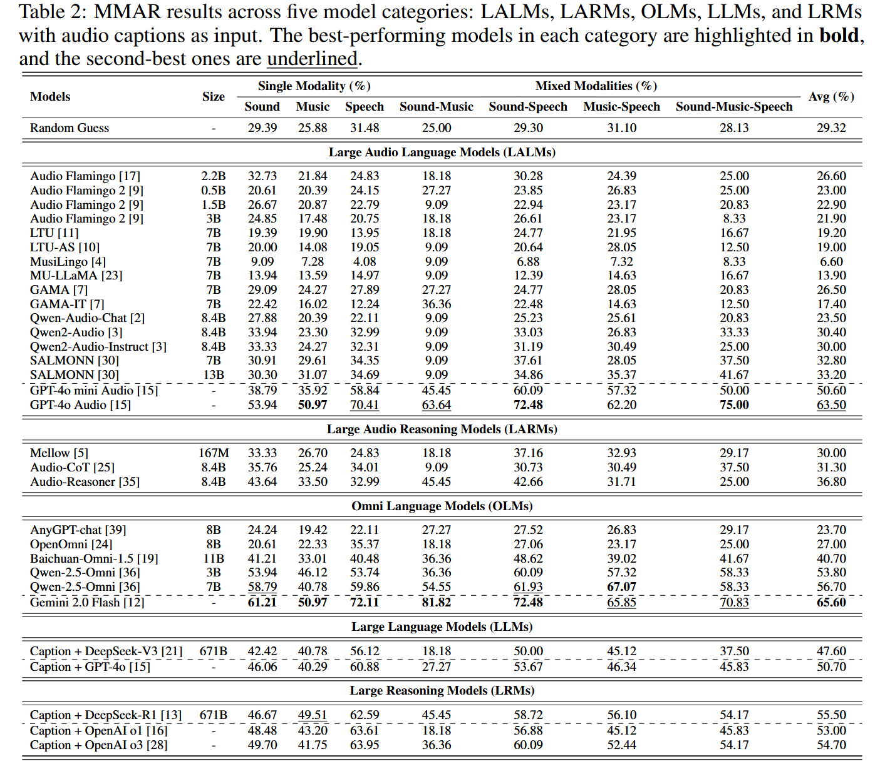
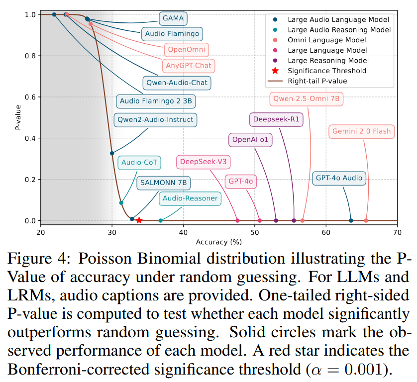
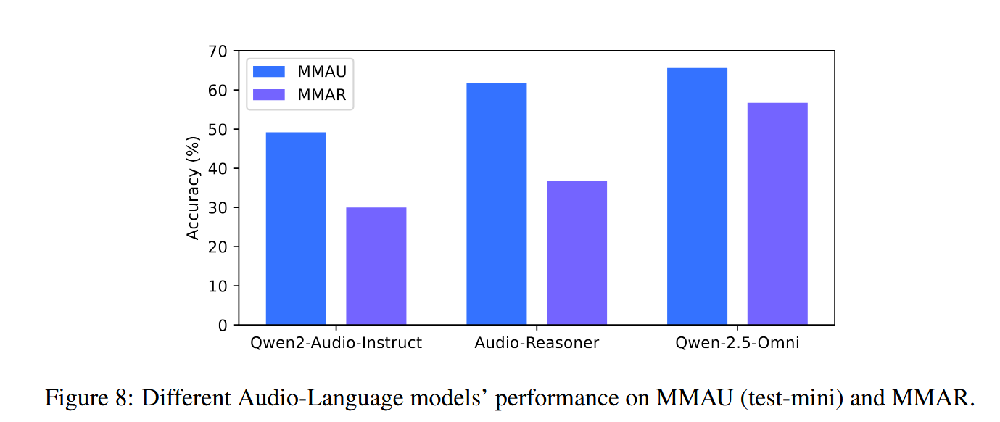
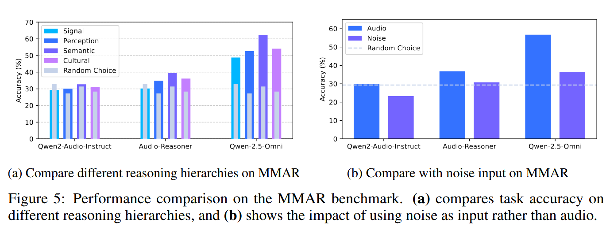
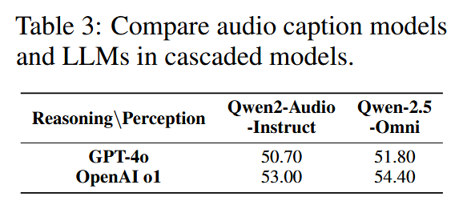

[TOC]

MMAR 是一个考察audio reasoning能力的benchmark，有1000个任务。

「论文」：https://arxiv.org/abs/2505.13032
「视频介绍」：https://www.youtube.com/watch?v=Dab13opIGqU
「MMAR中的题目，感受一下题目的难度和当前模型推理的能力水平」:https://www.axureshow.com/project/aeZcOaSp/

## 一、任务格式

每个任务的格式如下：

```python
@dataclass
class EachItem: 
    id : str # unique id
    audio_path : str # the local path of the audio file
    question : str # question of this task
    choices : list[str] # the answer pool
    answer : str # the right answer
    thinking : str # the cot of how to get the right answer
    modality : str # sound(16.5%),speech(29.4%),music(20.6%),mix-sound-speech(21.8%),mix-sound-music(1.1%),mix-speech-music(8.2%),mix-sound-speech-music(2.4%)
    category : str # Signal Layer(4.3%),Perception Layer(40.4%),Semantic Layer(41.2%),Cultural Layer(14.1%)
    sub-category : str # the value of each layer,see the below sub_categories dict
    language : str|None # the language contained in audio or null 
    source : str # youtube or something
    url : str # the website url of the origin video
    timestamp : str # the begining of the origin video to the end of the origin video
    cue : list[str] # the key to answer
    rubric : list[Rubric] # the standard of llm judger

@dataclass
class Rubric:
    name : str
    scoring_point : str
    note : str
    choices : list[str]

sub_categories : dict[str,list[str]] = {
    "Signal Layer":[
        "Acoustic Quality Analysis",
        "Anomaly Detection",
        "Audio Difference Analysis"
    ],
    "Perception Layer":[
        "Spatial Analysis",
        "Temporal Analysis",
        "Correlation Analysis",
        "Counting and Statistics",
        "Music Theory",
        "Environmental Perception and Reasoning"
    ],
    "Semantic Layer":[
        "Content Analysis",
        "Emotion and Intention",
        "Speaker Analysis"
    ],
    "Cultural Layer":[
        "Culture of Speaker",
        "Imagination",
        "Aesthetic Analysis"
    ]
}
```

## 二、评测方式

可以从`https://github.com/ddlBoJack/MMAR`仓库提供的`MMAR/MMAR-meta.jsonl`获取数据集文件，其code/文件夹下还提供了评测脚本（string_match和llm_as_a_judger两种方式）。

### 2.1 string_match

其中string_match的实现方法非常值得学习：

```python
def string_match(answer, prediction, choices):
    # Function to normalize and tokenize text
    def tokenize(text):
        # Convert to lowercase and find all word tokens
        return set(re.findall(r'\b\w+\b', text.lower()))
    
    # Tokenize prediction and answer
    prediction_tokens = tokenize(prediction)
    answer_tokens = tokenize(answer)
    
    if not prediction_tokens:
        return False
    
    # Tokenize incorrect choices and exclude tokens present in the answer
    incorrect_tokens = set()
    for choice in choices:
        choice_tokens = tokenize(choice)
        if choice_tokens != answer_tokens:
            incorrect_tokens.update(choice_tokens - answer_tokens)
    
    # Condition 1: All tokens of the answer are in the prediction
    cond1 = answer_tokens.issubset(prediction_tokens)
    
    # Condition 2: Prediction does not contain any tokens from incorrect choices (excluding shared words)
    cond2 = prediction_tokens.isdisjoint(incorrect_tokens)
    
    return cond1 and cond2
```

### 2.2 llm as a judger

见`MMAR-Rubrics-note.md`

## 三、评测对象

评测对象有:

- LALMs
- LARMs
- OLMs
- LLMs(with audio captions,so it's a cascaded system)
- LRMs(with audio captions,so it's a cascaded system)

## 四、实验设计和结果

### 4.1 

#### 4.1.1 不同评测对象在MMAR上的跑分



#### 4.1.2 poisson binomial distribution+bonferroni证明大部分开源模型几乎等于瞎蒙


#### 4.1.3 MMAR和MMAU的准确率对比实验


#### 4.1.4 结论

- MMAR很难
- 开源模型距离闭源还有很大的差距
- 无论什么模型和系统，cot对准确率的加成明显，说明了其必要性

#### 4.1.5 数学知识补贴

**1.poisson binomial**：

设定 N道题（MMAR约1000道），第 i 道题瞎蒙对的概率记为 $p_i$（四选一就大约是0.25，逐题可微调），$H_0$假设："这模型纯瞎蒙"。

第一步：算"瞎蒙总对数"的完整分布

定义随机变量 S = 瞎蒙情况下总共蒙对的题数。S是N个独立伯努利变量的和——每个$p_i$不同时，S的分布就叫Poisson Binomial。

它的概率质量函数用递推算：

$$P_n(k) = p_n \cdot P_{n-1}(k-1) + (1-p_n) \cdot P_{n-1}(k)$$

$$P_1(0) = 1 - p_1$$

$$P_1(1) = p_1$$

p(a) = P(S ≥ a·N) = 瞎蒙蒙对a以上的概率 = 把分布曲线右侧尾巴的面积加起来，可以画出p-a图，如figure4所示。

论文是按照每个题$$p_i = 1/choices $$画的曲线图。

**2.Bonferroni**:

我们设置每个模型p < 0.001就是判决线的位置：

对每个模型，我们都算出它的p值（纯瞎蒙蒙出它这个成绩的概率）。然后立一条规矩：只有当你的p值小于0.001，我才承认你"显著强于瞎蒙"；p ≥ 0.001，对不起，你的成绩手气就能解释，不予采信。

问题：这个阈值下，30个模型的总冤枉率是多少？

单个检验不冤枉的概率 = 1 − 0.001 = 0.999

30个检验相互独立，全都不冤枉 = 30个0.999连乘：(1 − 0.001)³⁰ ≈ 0.97

至少冤枉一个的概率：1 − 0.97 ≈ 0.03

结论：总冤枉率3%，比5%的要求还严格，合格。所以0.001这个阈值站得住。

### 4.2 对比实验（消融实验）

#### 4.2.1 不同layer的准确率对比实验，和random choice的对比实验，和noise input的对比实验：



#### 4.2.2 级联audio captions+llm/lrm的系统，不同基座的对比实验：



#### 4.2.3 结论

- signal layer对模型最难，semantic layer对模型最简单
- MMAR的局限性：即使流程规范，仍然有一定文本先验的干扰
- 提升audio captions的质量和llm/lrm两个部分都有助于MMAR指标的提升

### 4.3 错误分析实验

错误归因：

```python
error_type : dict[str,int] ={
    "Perceptual Error": 0.37，
    "Knowledger Error": 0.09,
    "Reasoning Error": 0.20,
    "Other Error": 0.34,
}

OtherError_type : dict[str,int] ={
    "Wrong Understanding of Instruction":0.03,
    "Choice Format Error":0.04,
    "Repeat Thinking and No Answer":0.12,
    "Correct Answer but Wrong Choice":0.15,
}
```

## 五、总结

MMAR 是一个考察audio reasoning能力的benchmark，有1000个任务，每个任务有固定的格式，支持两种评测方式(string_match和llm_as_a_judger)，两种的实现方式都非常值得学习。
MMAR 通过一系列实验，证明了以下结论：
- MMAR很难
- 开源模型距离闭源还有很大的差距,大部分开源模型在MMAR上和瞎猜没差别
- 无论什么模型和系统，cot对准确率的加成明显，说明了其必要性
- signal layer对模型最难，semantic layer对模型最简单
- MMAR的局限性：即使流程规范，仍然有一定文本先验的干扰
- 提升audio captions的质量和llm/lrm两个部分都有助于MMAR指标的提升